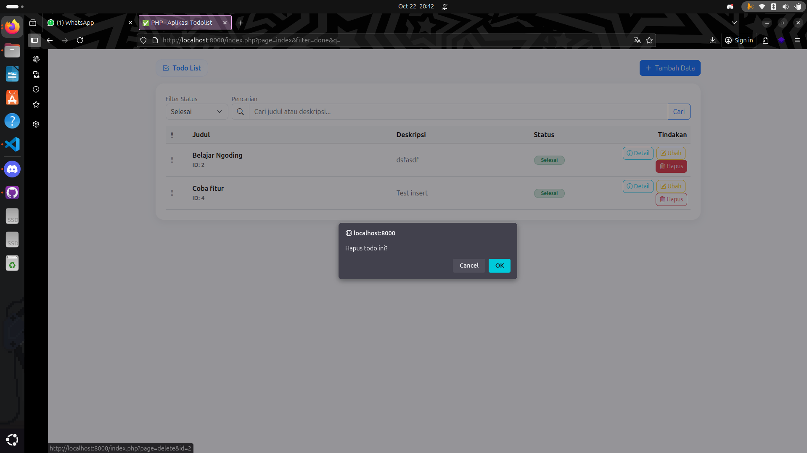

# ✅ Latihan PHP – Aplikasi Todo List (CRUD + PostgreSQL)

Aplikasi Todo List sederhana menggunakan **PHP Native (tanpa framework)** dengan arsitektur **MVC sederhana** dan database **PostgreSQL**.  
Aplikasi ini memiliki fitur **CRUD (Create, Read, Update, Delete)** dan tampilan antarmuka menggunakan **Bootstrap 5.3** yang modern serta responsif.

---

## 🖼️ Preview Aplikasi

Berikut adalah tampilan dari aplikasi Todo List yang sudah dijalankan di browser 👇  

### 🌐 Halaman Utama


---

### ➕ Modal Tambah Todo


---

### ℹ️ Modal Detail Todo


---

### 🚧 Status Todo

**Belum Selesai**


**Selesai**


---

### 🗑️ Hapus Todo


> 📸 **Catatan:** Simpan tangkapan layar aplikasi di folder `screenshots/` atau gunakan path lokal (`image.png`, `image-1.png`, dst.`) seperti contoh di atas agar gambar tampil otomatis di GitHub.

---

## 🚀 Teknologi yang Digunakan

- **Bahasa Pemrograman:** PHP 8.x  
- **Database:** PostgreSQL 16  
- **Frontend:** Bootstrap 5.3  
- **Arsitektur:** MVC Sederhana  
- **Web Server:** PHP Built-in Server (`php -S localhost:8000`)

---

## ⚙️ Konfigurasi Database PostgreSQL

1. Buat database baru bernama `db_todo`.
2. Jalankan SQL berikut di **pgAdmin** atau **psql**:

```sql
-- =============================================
--  UPGRADE DATABASE PHP TODO LIST (idempotent)
-- =============================================
SET search_path TO public;

CREATE TABLE IF NOT EXISTS public.todo (
    id          INT GENERATED BY DEFAULT AS IDENTITY PRIMARY KEY,
    title       VARCHAR(250) NOT NULL,
    is_finished BOOLEAN NOT NULL DEFAULT FALSE,
    description TEXT,
    sort_order  INT NOT NULL DEFAULT 0,
    created_at  TIMESTAMP DEFAULT CURRENT_TIMESTAMP,
    updated_at  TIMESTAMP DEFAULT CURRENT_TIMESTAMP
);

-- Sinkronisasi kolom lama (activity/status) jika masih ada
DO $$
BEGIN
    IF EXISTS (
        SELECT 1 FROM information_schema.columns
        WHERE table_schema='public' AND table_name='todo' AND column_name='activity'
    ) THEN
        EXECUTE 'ALTER TABLE public.todo RENAME COLUMN activity TO title';
    END IF;
    IF EXISTS (
        SELECT 1 FROM information_schema.columns
        WHERE table_schema='public' AND table_name='todo' AND column_name='status'
    ) THEN
        EXECUTE 'ALTER TABLE public.todo RENAME COLUMN status TO is_finished';
    END IF;
END $$;

-- Trigger untuk update otomatis kolom updated_at
CREATE OR REPLACE FUNCTION public.update_timestamp()
RETURNS TRIGGER AS $$
BEGIN
  NEW.updated_at := CURRENT_TIMESTAMP;
  RETURN NEW;
END; $$ LANGUAGE plpgsql;

DROP TRIGGER IF EXISTS update_todo_timestamp ON public.todo;
CREATE TRIGGER update_todo_timestamp
BEFORE UPDATE ON public.todo
FOR EACH ROW
EXECUTE FUNCTION public.update_timestamp();
